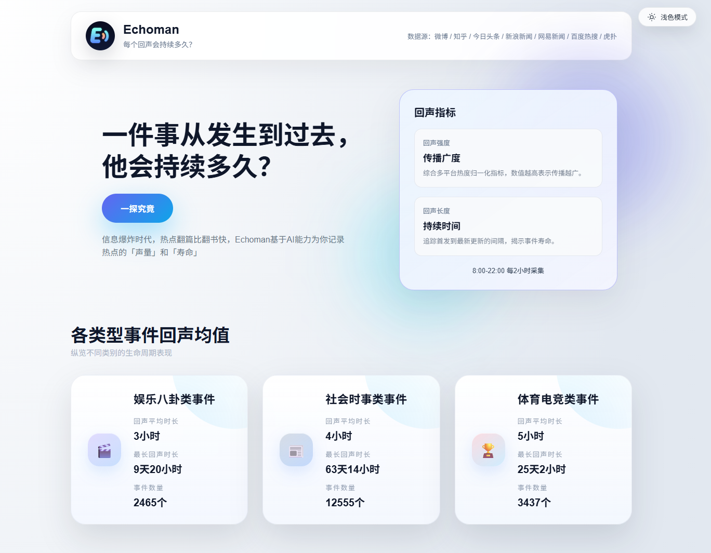
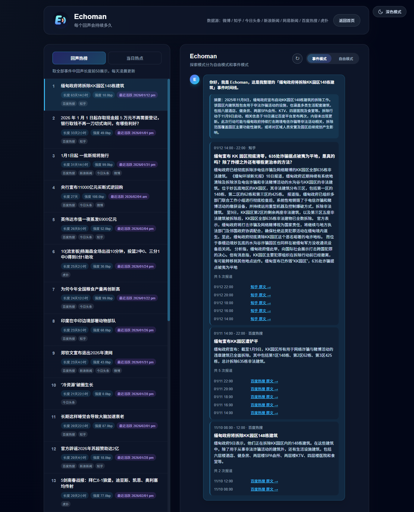

# 📡 Echoman

<p align="center">
  <pre>
  ███████╗ ██████╗██╗  ██╗ ██████╗ ███╗   ███╗ █████╗ ███╗   ██╗
  ██╔════╝██╔════╝██║  ██║██╔═══██╗████╗ ████║██╔══██╗████╗  ██║
  █████╗  ██║     ███████║██║   ██║██╔████╔██║███████║██╔██╗ ██║
  ██╔══╝  ██║     ██╔══██║██║   ██║██║╚██╔╝██║██╔══██║██║╚██╗██║
  ███████╗╚██████╗██║  ██║╚██████╔╝██║ ╚═╝ ██║██║  ██║██║ ╚████║
  ╚══════╝ ╚═════╝╚═╝  ╚═╝ ╚═════╝ ╚═╝     ╚═╝╚═╝  ╚═╝╚═╝  ╚═══╝
  </pre>
  <p align="center">
    <b>信息爆炸时代，一个热点能持续多久？</b><br>
    —— 热点事件聚合与回声追踪 ——
  </p>
</p>

---

# 📖 Echoman

**Echoman** 是一款热点生命周期监测工具。它通过“多平台热点抓取 → 相关事件归并为话题 → 追踪回声长度与强度 → AI 问答”的完整链路，帮助用户穿透碎片化的信息流，洞察一个热点从引爆到平息的全过程，量化信息的传播生命力。

> **Echoman - 捕捉每一个热点的余震。**




---

## ✨ 核心功能

### 🔍 1. 全网热点雷达 (Ear)
*   **多源监控**：实时采集 7 大主流平台（微博、知乎、头条、网易、新浪、百度、虎扑）。
*   **智能降噪**：自动过滤“点击查看更多”等垃圾链接及无效信息。
*   **高频采集**：每日 8 次定时扫描，确保不漏掉任何舆情波动。

### 🧠 2. 智能归并大脑 (Brain)
*   **双阶聚类**：采用“语义向量相似度 + 大模型（LLM）判定”双重逻辑，将不同平台的同类词条精准归并为独立“话题”。
*   **历史溯源**：新热点自动回溯历史库，老话题持续更新，记录事件演进。

### 📈 3. 回声指标追踪 (Echo)
*   **生命周期量化**：计算**回声长度**（持续时间）与**回声强度**（全网热度叠加）。
*   **分类洞察**：自动划分为娱乐、社会时事、体育电竞三大领域。

### 💬 4. Agent 深度对话 (Chat)
*   **话题/全局双模式**：支持针对特定话题的深度挖掘，或对全网热点的综合问答。
*   **流式响应 (SSE)**：支持 AI 流式输出，提供丝滑的对话体验。

---

## 🚀 快速启动

### 🛠️ 前置要求
*   Python 3.11+
*   Node.js 18+
*   Docker & Docker Compose（用于运行 PostgreSQL/Redis）

### 1️⃣ 后端配置
复制模板并配置环境变量：
```bash
cp env.template .env
```
> **注意**：重点修改 `.env` 中的 `LLM_PROVIDER`、`API_KEY` 以及数据库连接信息。

### 2️⃣ 启动后端 (API + Worker + DB)
使用一键脚本启动所有核心服务（含数据库初始化）：
```bash
chmod +x start.sh
./start.sh
```
*   **后端默认端口**：`8778`
*   **Swagger 文档**：`/docs`

### 3️⃣ 启动前端
```bash
python frontend.py
```
*   **前端默认端口**：`5173`（内置 API 代理）

---

## 🛠️ 技术栈

| 模块 | 技术实现 |
| :--- | :--- |
| **后端框架** | FastAPI (Python) |
| **异步任务** | Celery + Redis |
| **数据库** | PostgreSQL (持久化) |
| **向量检索** | ChromaDB (本地持久化) |
| **前端框架** | React + Vite + Tailwind CSS |
| **大模型集成** | Qwen / OpenAI /等 |

---

## 🔗 常用 API 概览

| 功能 | 路径 | 描述 |
| :--- | :--- | :--- |
| **话题列表** | `GET /api/v1/topics` | 获取聚合后的热点列表（含回声指标） |
| **热点溯源** | `GET /api/v1/topics/{id}/timeline` | 查看单个热点的时间演进线 |
| **AI 问答** | `POST /api/v1/chat/ask` | 支持全局或特定话题的 RAG 问答 |
| **手动采集** | `POST /api/v1/ingest/run` | 立即触发全网热点采集任务 |
| **统计摘要** | `GET /api/v1/categories/metrics/summary` | 各分类热度与回声数据汇总 |

---

## 🧹 数据维护

如需清理采集过程中的噪音数据，可运行：
```bash
python backend/scripts/cleanup_noise_items.py --apply
```

---

## 📄 许可证

本项目采用 [MIT](LICENSE) 许可证。
